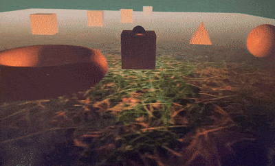

# Computer Graphics Projects

The repository contains four projects related to computer graphics. Each project focuses on different aspects of 2D and 3D graphics, including polygon editing, Bézier surface rendering, image animation, and the creation of 3D scenes using a programmable rendering pipeline.

## 1. Polygon Editor
An interactive editor for manipulating polygons and Bézier segments. Key features:
- Adding, editing and deleting polygons
- Moving vertices and control points of Bézier segments
- Ability to add constraints (relationships) for edges:
  - Horizontal and vertical edges
  - Specified edge length
- Conversion of edges to 3rd-degree Bézier segments with various continuity classes (G0, G1, C1)
- Drawing algorithms:
  - Line segments: library algorithm and custom implementation (Bresenham)
  - Bézier segments: iterative algorithm for determining points following conversion to a power basis
- Predefined scene with constraints and at least one Bézier segment

## 2. Bézier surface
A programme that renders a third-degree Bézier surface based on control points loaded from a file. Features:
- Rotation of the surface around the Z and X axes (alpha and beta angles adjustable via sliders)
- Triangulation of the surface and interpolation using triangles
- Orthogonal projection of the surface onto the XY plane
- Choice of rendering mode: mesh / triangle fill
- Lighting using the Lambertian model and a specular component
- Ability to animate the movement of a light source along a spiral
- Support for textures and normal vector maps

## 3. Image Movement

  

- Animation of an image moving along a curve
- The image rotates tangentially to the curve
- Ability to pause the movement and switch to rotation around the centre
- Support for naive rotation and filtering
- Interactive repositioning of curve vertices during animation

## 4. 3D Scene
A project utilising graphics APIs (e.g. OpenGL, DirectX, WebGL) to render an interactive 3D scene.

  

### Key features:
- Programmable rendering pipeline (shaders)
- Objects in the scene:
  - One moving object (with movement and rotation)
  - Several stationary objects (including at least one smooth surface)
- Switchable cameras:
  - A stationary camera observing the scene
  - A stationary camera tracking the moving object
  - A camera tied to the moving object (FPP/TPP)
- Lighting:
  - 3 light sources (including a spotlight on the moving object)
  - Manual adjustment of the spotlight’s direction
  - Fixed light source (spotlight or floodlight)
- Effects:
  - Perspective projection
  - Phong shading model (normal interpolation)
  - Fog effect
  - Switching between day and night
  - Light fading with distance
    
